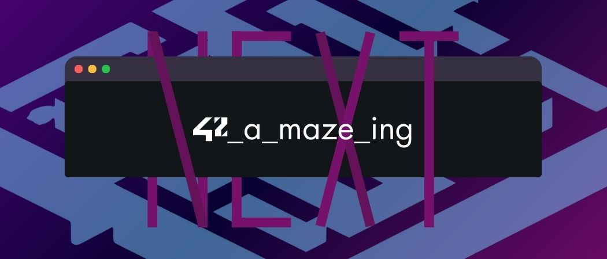
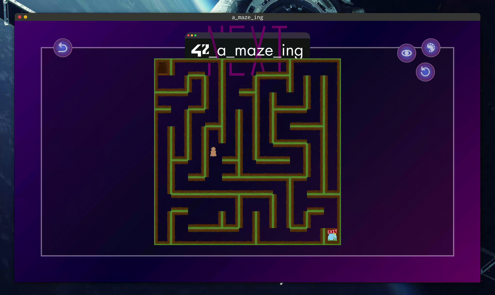

*This project has been created as part of the 42 curriculum by jvizcain, dde-fite*

    
    <h1 align="center">42_a_maze_ing</h1>

    

This work is published under the terms of <a href="LICENSE"><b>MIT license</b></a>

    <h2>Maze generator with visualizer built using Python and MiniLibX.</h2>
    <!--  -->

## Description

## Instructions

## Resources