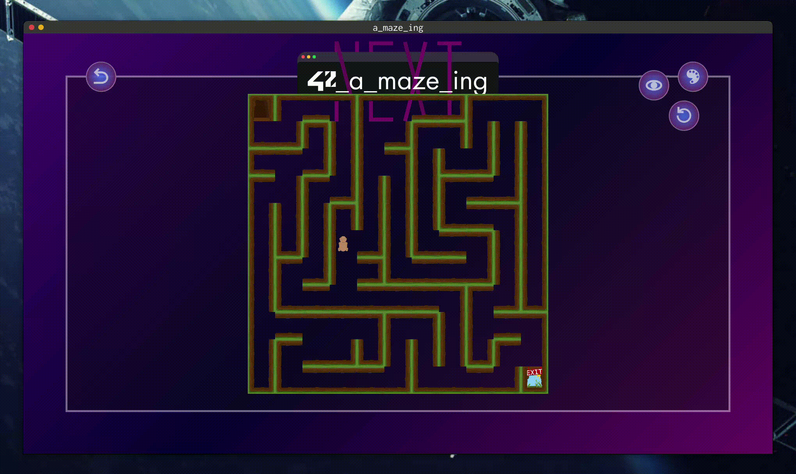
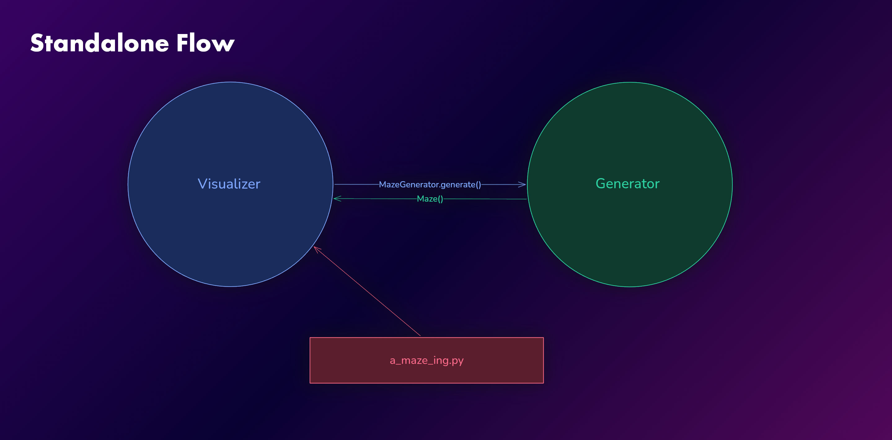
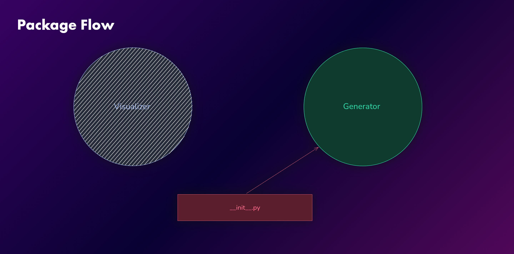
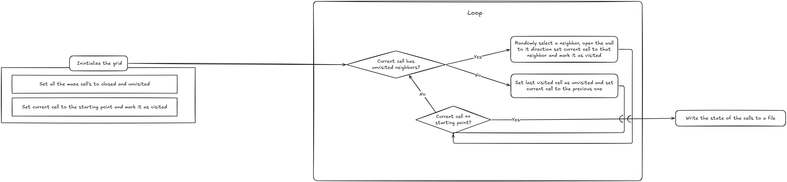

*This project has been created as part of the 42 curriculum by jvizcain, dde-fite*

<p align="center">
    
    <h1 align="center">42_a_maze_ing</h1>
</p>

<p align="center">
    
</p>

<p align="center">
This work is published under the terms of <a href="LICENSE"><b>MIT license</b></a>
</p>

<div align="center">
    <h2>Maze generator with visualizer built using Python and MiniLibX.</h2>
    
</div>

## Description

Procedural map generation is one of the foundations of all current and not-so-current games. If we analyze any game, we can find these algorithms everywhere, whether in the map or even in the textures.

a_maze_ing is the first Python project in the new 42 curriculum. The idea is to randomly generate a maze according to the parameters you specify and visualize it graphically. In addition, it must store a file with the maze data.

```bash
python3 a_maze_ing.py config.txt
...
```

To achieve a 100% score, the project must be able to create the map and display it without any unhandled errors. If it has extra features, as is our case, it will be evaluated in the bonus section with up to 125%.

## Structure
Divided into two separate and independent pillars: the Generator and the Viewer. Each performs its tasks separately, and although the viewer calls the generator, it can function without it.

Depending on how a_maze_ing is called, the execution flow will vary between a standalone mode and a headless mode.

### Standalone

The standalone flow is executed with `python3 a_maze_ing.py <config file>`.

The entry point calls the visualizer created with our graphics engine. This initializes everything required for rendering and displays the program menu. From here, you can access different sections of the program.

When a maze needs to be generated, the generator will be interacted with through the MazeGenerator class. If there are no errors, it will return an object of the Maze class with the generated maze itself.

Then, the viewer will iterate over it to spawn each cell of the maze and render its texture.



### Headless

Headless mode is used by importing the package with `from mazegen import MazeGenerator, ...`

When importing it as a package, it will call the \_\_init\_\_.py of a_maze_ing, which only exposes the generator.

From here, you can call it whenever a maze is required with `generate(config file)`, which will return an object of the Maze class with all the data required to use it in your project.

In case of an error generating the maze, the following errors may be invoked:
- `FileNotFoundError`: Configuration file not found.
- `ConfigError`: The configuration file contains incorrect data or some data is missing.
- `MazeError`: Any error related to the maze generation process itself.



## Generation Algorithm

Recursive Backtracking is one of the most popular and intuitive algorithms for generating perfect mazes (mazes without loops and with exactly one path between any two cells if it is perfect). It is based on a depth-first search (DFS) strategy and produces long, winding corridors with a natural-looking structure.

### How it works



1. **Initialize the grid**.

    Create a grid where each cell is surrounded by walls.

    Mark all cells as unvisited.

    Choose a starting cell (starting point can be used).

    Mark it as visited.

    Add this cell to the list of visited cells.

2. **If the current cell has unvisited neighbors**:

    Randomly select one.

    Remove the wall between the current cell and the chosen neighbor.

    Mark the neighbor as visited.

    Push the current cell onto the stack.

    Move to the neighbor.

3. **Otherwise**:

    Pop the last cell of the list of visited cells (backtrack).

    The current cell will now be the previous one.

The algorithm ends when the current point is the starting point and there is no possible way to move to (meaning that all cells were already visited).

## Visualizer
The display works using the [Mlx Python Game Engine](https://github.com/dde-fite/Mlx_Python_Game_Engine) graphics engine, which we created ourselves for this project.

This graphics engine is very complex, and explaining it in detail would be tedious and beyond the scope of this README.

In general terms, is a graphics engine that attempts to resemble Unity and uses the Python wrapper for MiniLibX. It is capable of rendering and updating each frame completely independently of MiniLibX and accepting user input in a simple manner.

<div align="center">
    <a href="https://github.com/dde-fite/Mlx_Python_Game_Engine">
        
        
    </a>
</div>

<p align="center">
  <a href="https://github.com/dde-fite/Mlx_Python_Game_Engine">
    Learn more about Mlx Python Game Engine
  </a>
</p>


## Instructions

## Usage

### Standalone (Visualizer + Generator)

Install the requirements with pip. Is recommended to use a Virtual Environment.

```bash
pip install -r requirements.txt
```

Run the program.

```bash
python3 a_maze_ing.py <config file>
```

### As a package (Generator)

Install the package with pip.

```bash
pip install mazegen-1.0.0-py3-none-any.whl
```

Now you can use it in your project.

```python
from mazegen import MazeGenerator, Maze, Cell

MazeGenerator.generate("config.txt")
```

## Making package
```bash
python -m build
```

## Resources

We used the example of this page to understand how the algorithm used for the generation works:

https://weblog.jamisbuck.org/2010/12/27/maze-generation-recursive-backtracking
